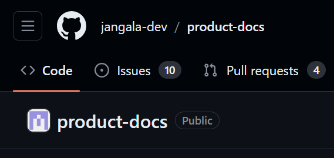
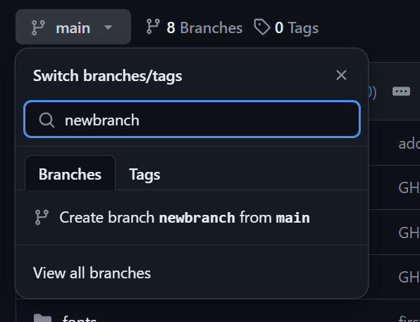

# Creating a Pull Request

1. **Open the GitHub repository**: Navigate to the [product-docs repository](https://github.com/jangala-dev/product-docs) on GitHub.

2. **Create a new branch**: Click on the `Code` tab and then click on the `Branch: main` dropdown. Enter a new branch name and click `Create branch`.

3. **Navigate to the docs folder**: Navigate to the [`docs`](https://github.com/jangala-dev/product-docs/tree/main/docs)  folder in the repository to find the documentation files you want to edit.
4. **Make changes**: Make your changes to the documentation using Github web Interface by clicking edit icon on the top right as shown in the below screenshot or using Local IDE. All the files are written in markdown format. You can refer to the [Markdown Guide](https://guides.github.com/features/mastering-markdown/) for help with formatting.

6. **Commit changes**: Once you've made your changes, commit them to your branch.

8. **Open a pull request**: Navigate to the `Pull requests` tab and click on `New pull request`. Select the branch you made changes to and the `main` branch. Click `Create pull request`.

10. **Describe your changes**: Provide a title and description for your pull request. Click `Create pull request` to submit it.
11. **Review and merge**: Your pull request will be reviewed by the maintainers. Once approved, it will be merged into the main branch.
12. **Delete your branch**: After your pull request is merged, you can delete your branch.

## Video Walkthrough (Optional)

<video src="/contributing-video.mp4"  height="240" controls></video>

**Congratulations!**: You've successfully contributed to the product documentation.

**Thank you!**: We appreciate your contribution and look forward to more contributions from you in the future.

**Questions**: If you have any questions or need help with contributing, please feel free to reach out to us.

**Feedback**: We welcome feedback on the contribution process and are open to suggestions for improvement.

**Happy Contributing!**: We hope you enjoy contributing to our product documentation and look forward to your contributions.