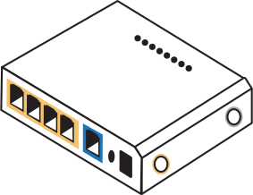
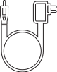

<style>h1,h2,h3,h4 { border-bottom: 0; } </style>

# Getting Started
Check you have everything you need.
Here's a checklist of what you'll need to get set up:

|                 |                 |
| --------------- | --------------- |
|  Get Box |  <br/> X2 Antennas with Yellow Dots |
|  <br/> X2 Antennas with White Dots |  <br/> Power Cable |
|  <br/> SIM Adapter | 
|                 |                 |

# My markdown document

```{=typst}
#let foob(x) = { x + x }
#foob
```