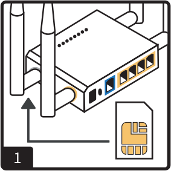
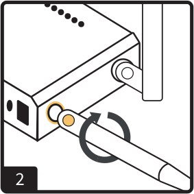
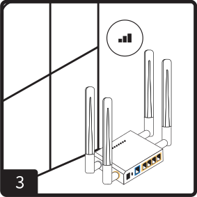
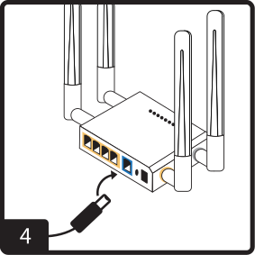
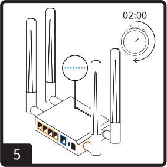
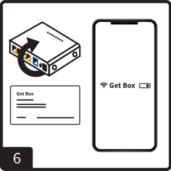

# Setting Up:
## Setting up and using Get Box

|                 |                 |
| --------------- | --------------- |
|    Insert the SIM card into the Get Box |    Screw the antennas into the colour-coordinated ports |
|    Place Get Box near a window. Your signal may be stronger fi you move it to a location with a clear view of the sky |    Plug in Get Box using the power supply. It will turn on automatically. Please refer to Safety Information, p. 6-7 |
|    Wait 2 minutes. The LED lights on the front of Get Box wil become regular |    On your phone or computer, connect to the Wi-Fi network *GetBox*. The full name and password can be found on the bottom of your Get Box

**You are now connected and can start browsing the internet**