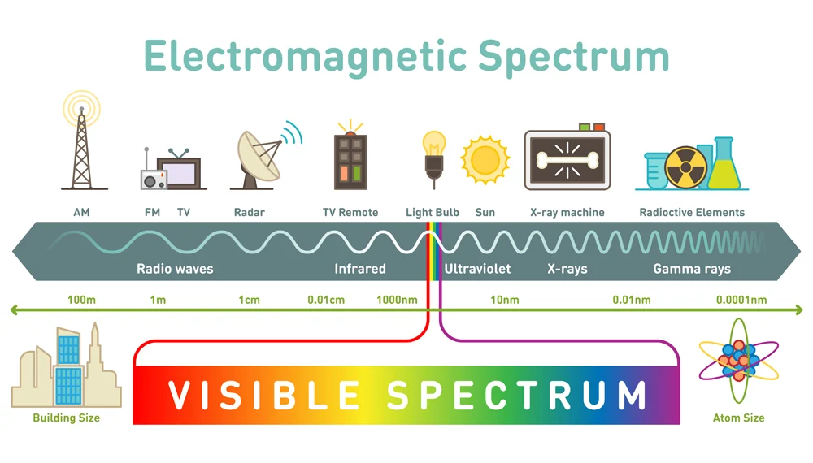

# Networking: How We're Connected

Welcome to a quick dive into how networking powers connectivity at Jangala! Whether you're tech-savvy or just curious about the technical underpinnings, this guide will provide you with key insights into how our products share connectivity.

## Wi-Fi Connectivity

Our devices broadcast Wi-Fi at two main frequencies: 2.4GHz and 5GHz, which are part of the radio band of the electromagnetic spectrum. The 2.4GHz band offers extensive coverage and greater range, making it ideal for reaching through walls and other barriers. In contrast, the 5GHz band provides faster data speeds due to the ability to duel band, perfect for high-bandwidth activities like streaming and gaming.

{ width=70% }  

## Backhaul Options

To connect to the broader internet, our devices primarily use three types of backhaul: cellular towers, satellite, and cable. Each has its advantages — cable is reliable for steady connections, satellite covers wide areas beyond other infrastructures, and cellular offers flexibility with mobile access. This diversity ensures that our devices maintain connectivity in various settings.

## IP Addresses

Each device connected to our Wi-Fi is assigned an IP address, akin to a postal address on the internet. This ensures that data packets are accurately delivered to and from your device, whether it's communicating within your home network or across the internet.

## Routing and Data Retrieval

When you send a request from your device, it is routed through the network to access the internet. The request is first transmitted from your device to your router. From the router, it moves to the Wide Area Network (WAN) and then to a DNS server, which translates the domain name into an IP address. Next, the request is routed to the appropriate data center to retrieve the requested data. The response travels back along a similar path until it reaches your device.

Understanding this process helps you appreciate the basic workings of the internet and how our devices communicate.
